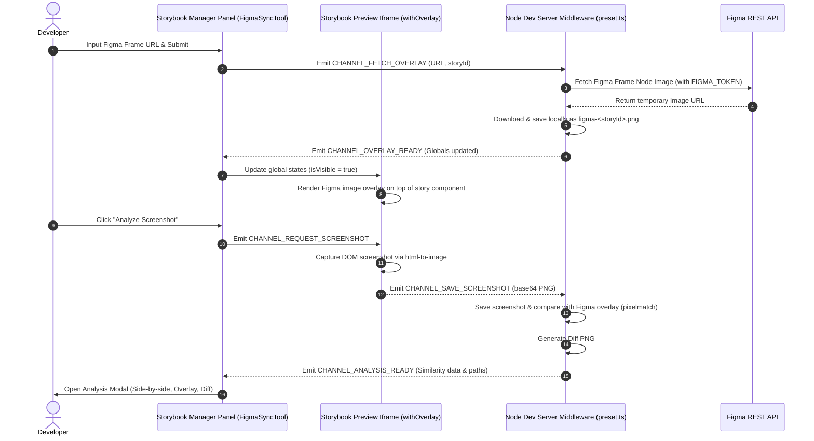

# Storybook Addon Figma Sync

[](https://www.npmjs.com/package/storybook-addon-figma-sync)
[](https://storybook.js.org/)
[](https://opensource.org/licenses/MIT)

A Storybook addon designed to sync Figma design frames directly into Storybook stories. It enables developers to overlay mockups on top of live components with adjustable opacity, auto-resize the Storybook preview iframe to match Figma dimensions, and perform pixel-level visual regression diffing directly in the browser to ensure absolute design fidelity.

---

## Key Features

- **Figma Design Integration**: Input any Figma Frame URL in the Storybook toolbar to download and display design mockups.
- **Interactive Visual Overlay**: Render the Figma mockup directly over your live component with customizable opacity (0% to 100%) and a toggle switch.
- **Automated Component Sizing**: Storybook's preview iframe automatically resizes to the exact dimensions of the Figma design frame, ensuring realistic component alignment.
- **Pixel-Matching Similarity Analysis**: Captures a high-fidelity DOM screenshot of the rendered component using `html-to-image` and compares it pixel-by-pixel with the Figma design using `pixelmatch`.
- **REST API for Automation**: Trigger visual audits programmatically via a dev server endpoint, featuring automatic story navigation, render delay buffers, and solid white background compositing for consistent pixelmatch results.
- **Advanced Analysis Modal**: Switch between three comparison views in the visual audit panel:
  - **Side-by-Side**: Compare the Figma design and live component screenshot side by side.
  - **Overlay (Interactive)**: A draggable and zoomable canvas layer where the Figma mockup is overlaid on the component screenshot.
  - **Diff Only**: A visual diff highlighting the pixel mismatch errors in red.
- **Single JSON Registry (`registry.json`)**: Persists all sync metadata—such as Story ID, Figma URLs, asset paths, similarity scores, overlay visibility, and opacity percentages—in a single database file, isolating settings per story.
- **Caching Mechanism**: Downloaded Figma design images are stored locally under `.storybook/.storybook-addon-sync-figma/` for fast loading and reduced API consumption.

---

## Data Flow & Component Interaction



---

## Getting Started

### Prerequisites

- A Figma account and a **Figma Personal Access Token (PAT)**. You can generate one in Figma by going to `Settings > Account > Personal access tokens`.

### Installation

Install the package as a development dependency using your package manager:

```bash
yarn add -D storybook-addon-figma-sync
# or
npm install --save-dev storybook-addon-figma-sync
# or
pnpm add -D storybook-addon-figma-sync
```

### Configuration

#### 1. Register the Addon

Add the addon to your `.storybook/main.ts` file:

```typescript
import type { StorybookConfig } from '@storybook/react-vite';

const config: StorybookConfig = {
  stories: ['../src/**/*.mdx', '../src/**/*.stories.@(js|jsx|ts|tsx)'],
  addons: [
    '@storybook/addon-docs',
    {
      name: 'storybook-addon-figma-sync',
      options: {
        envLocation: '../.env', // Path to your environment file containing FIGMA_TOKEN
      },
    },
  ],
  // Map local cache directory to static URL in Storybook
  staticDirs: [{ from: './.storybook-addon-sync-figma', to: '/figma-sync-assets' }],
  framework: '@storybook/react-vite',
};

export default config;
```

#### 2. Set Up Environment Variables

Create a `.env` file at the root of your project:

```bash
FIGMA_TOKEN=your_figma_personal_access_token_here
```

#### 3. Update Git Ignore

Add the local cache folder to your `.gitignore` to prevent committing cached Figma designs and screenshot differences:

```bash
.storybook/.storybook-addon-sync-figma/
```

---

## REST API for Automated Visual Audits

The addon exposes a built-in REST API endpoint on the Storybook dev server for programmatic triggers (e.g., for CI pipelines, external/agentic scripts, or AI slicing tools).

### Endpoint

```http
GET http://localhost:6006/api/figma-sync/screenshot?storyId=<STORY_ID>
```

### Response Example

```json
{
  "success": true,
  "figmaSrc": "/figma-sync-assets/figma-<storyId>.png",
  "screenshotSrc": "/figma-sync-assets/ss-<storyId>.png",
  "diffSrc": "/figma-sync-assets/diff-<storyId>.png",
  "similarity": 94.25
}
```

### Key Behaviors

1. **Auto-Navigation**: The dev server middleware automatically navigates the active story in the Storybook preview iframe to match the requested `storyId`, utilizing a `1200ms` delay buffer to let the render tree settle before capturing the screenshot.
2. **Transparency Compositing**: To resolve false mismatches from alpha channel transparency (e.g., empty backgrounds, transparent PNGs), both the Figma mockup and the captured screenshot are composited onto a solid white background prior to pixelmatch comparison.
3. **Ignoring Elements**: Specific HTML elements can be excluded from screenshots by applying the `data-figma-sync-ignore="true"` attribute to them.

---

## License

This project is licensed under the **MIT License**.
