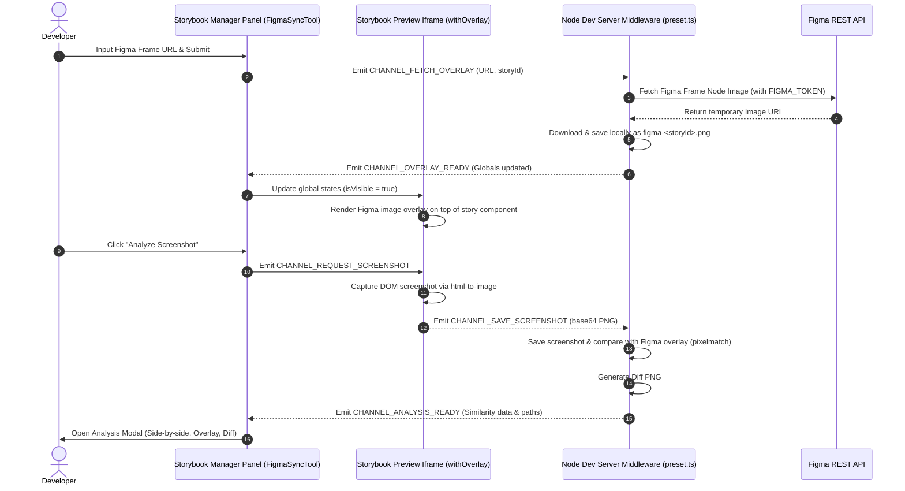

# Storybook Addon Figma Sync

[](https://www.npmjs.com/package/storybook-addon-figma-sync)
[](https://storybook.js.org/)
[](./LICENSE)
[](#contributing)

A Storybook addon designed to sync Figma design frames directly into Storybook stories. It enables developers to overlay mockups on top of live components with adjustable opacity, auto-resize the Storybook preview iframe to match Figma dimensions, and perform pixel-level visual regression diffing directly in the browser to ensure absolute design fidelity.

---

## Key Features

- **Figma Design Integration**: Input any Figma Frame URL in the Storybook toolbar to download and display design mockups.
- **Interactive Visual Overlay**: Render the Figma mockup directly over your live component with customizable opacity (0% to 100%) and a toggle switch.
- **Automated Component Sizing**: Storybook's preview iframe automatically resizes to the exact dimensions of the Figma design frame, ensuring realistic component alignment.
- **Pixel-Matching Similarity Analysis**: Captures a high-fidelity DOM screenshot of the rendered component using `html-to-image` and compares it pixel-by-pixel with the Figma design using `pixelmatch`.
- **Advanced Analysis Modal**: Switch between three comparison views in the visual audit panel:
  - **Side-by-Side**: Compare the Figma design and live component screenshot side by side.
  - **Overlay (Interactive)**: A draggable and zoomable canvas layer where the Figma mockup is overlaid on the component screenshot.
  - **Diff Only**: A visual diff highlighting the pixel mismatch errors in red.
- **Single JSON Registry (`registry.json`)**: Persists all sync metadata—such as Story ID, Figma URLs, asset paths, similarity scores, overlay visibility, and opacity percentages—in a single database file, isolating settings per story.
- **Caching Mechanism**: Downloaded Figma design images are stored locally under `.storybook/.storybook-addon-sync-figma/` for fast loading and reduced API consumption.

---

## Technology Stack

- **React 19**: Drives the Storybook addon manager UI, interactive comparison canvas, and modal interfaces.
- **Storybook 8+**: Integrates with the modern Storybook core channels, globals, parameters, and component registry.
- **TypeScript**: Ensures type safety across all frontend and backend middleware.
- **Vite & Webpack**: Exposes Node.js dev server middlewares to serve and cache Figma assets.
- **TailwindCSS v4**: Integrated for styling storybook components and styling tests.
- **Pixelmatch**: A pixel-level image comparison library written in JavaScript.
- **pngjs**: Enables direct PNG decoding, diff output, and encoding inside the Node.js server.
- **html-to-image**: Converts DOM nodes to high-resolution PNG data URLs on the client.
- **tsup**: Bundler configured to output targeted ESM modules for the manager, preview, and Node.js preset.
- **Vitest**: Used as the test runner for unit tests.

---

## Project Architecture

The addon is structured into three main layers: **Manager UI** (the settings toolbar), **Preview iframe** (overlay and screenshot capture), and **Node server preset** (handles Figma API interaction and image comparisons).

### Data Flow & Component Interaction



---

## Getting Started

### Prerequisites

- A Figma account and a **Figma Personal Access Token (PAT)**. You can generate one in Figma by going to `Settings > Account > Personal access tokens`.

### Installation

Install the package as a development dependency using your package manager:

```bash
yarn add -D storybook-addon-figma-sync
# or
npm install --save-dev storybook-addon-figma-sync
# or
pnpm add -D storybook-addon-figma-sync
```

### Configuration

#### 1. Register the Addon

Add the addon to your `.storybook/main.ts` file:

```typescript
import type { StorybookConfig } from '@storybook/react-vite';

const config: StorybookConfig = {
  stories: ['../src/**/*.mdx', '../src/**/*.stories.@(js|jsx|ts|tsx)'],
  addons: [
    '@storybook/addon-docs',
    {
      name: 'storybook-addon-figma-sync',
      options: {
        envLocation: '../.env', // Path to your environment file containing FIGMA_TOKEN
      },
    },
  ],
  // Map local cache directory to static URL in Storybook
  staticDirs: [{ from: './.storybook-addon-sync-figma', to: '/figma-sync-assets' }],
  framework: '@storybook/react-vite',
};

export default config;
```

#### 2. Set Up Environment Variables

Create a `.env` file at the root of your project:

```bash
FIGMA_TOKEN=your_figma_personal_access_token_here
```

#### 3. Update Git Ignore

Add the local cache folder to your `.gitignore` to prevent committing cached Figma designs and screenshot differences:

```bash
.storybook/.storybook-addon-sync-figma/
```

---

## Project Structure

```
storybook-addon-figma-sync/
├── .storybook/                     # Local Storybook sandbox configuration
│   ├── .storybook-addon-sync-figma/ # Local cache directory for Figma downloads & diffs (Git ignored)
│   ├── local-preset.ts             # Sandbox entry points importing dist assets
│   ├── main.ts                     # Sandboxed Storybook config
│   └── preview.ts                  # Sandbox preview globals
├── scripts/                        # Automation & prepublish scripts
├── src/                            # Source directory
│   ├── components/                 # React UI Components
│   │   ├── FigmaSyncTool/          # Toolbar panel settings button & popover
│   │   │   ├── index.tsx
│   │   │   ├── Field.tsx
│   │   │   └── PopoverContent.tsx
│   │   ├── AnalysisModal/          # Side-by-side, overlay, and diff comparison panel
│   │   │   ├── index.tsx
│   │   │   ├── ImageViewer.tsx
│   │   │   ├── SideBySideView.tsx
│   │   │   ├── OverlayView.tsx
│   │   │   ├── DiffView.tsx
│   │   │   └── TransformContext.tsx
│   │   └── useOverlayImage.ts      # Hooks to verify image availability & resize preview iframe
│   ├── lib/                        # Helper libraries
│   │   ├── figma-sync-preview.ts   # URL parser and browser screenshot capturing configuration
│   │   ├── figma-sync-server.ts    # Node.js file writer, Figma API fetcher, and pixelmatch comparison
│   │   ├── load-image.ts           # Async image loader utility
│   │   └── utils.ts                # Tailwind merge helper (cn)
│   ├── constants.ts                # Channel event names, storybook keys, and default values
│   ├── global.d.ts                 # Global type definitions
│   ├── index.css                   # Custom styles
│   ├── index.ts                    # Addon default exported preview config
│   ├── manager.tsx                 # Register toolbar buttons in Storybook Manager
│   ├── preset.ts                   # Webpack and Vite middlewares configuration for Storybook
│   └── preview.ts                  # Storybook iframe setup, global parameters, and overlay decorator
├── package.json                    # Package metadata, script pipelines, dependencies
├── tsconfig.json                   # Strict TypeScript compiler options
└── tsup.config.ts                  # Bundler configuration separating Manager, Preview, and Node targets
```

---

## Development Workflow

### Local Development

To run the Storybook project locally and develop the addon:

```bash
yarn start
```

This runs the `tsup` compiler in watch mode (rebuilding code in real-time) and launches the Storybook developer server concurrently.

### Build and Package

To build the project for production distribution:

```bash
yarn build
```

This uses `tsup` to bundle all inputs. It splits files according to their execution targets:

- `dist/manager.js` (Browser Manager UI)
- `dist/preview.js` & `dist/preview.d.ts` (Browser Preview Iframe)
- `dist/preset.js` (Node.js Dev Server Middlewares)

### Ejecting TypeScript

If you wish to convert this template to standard JavaScript, you can run:

```bash
yarn eject-ts
```

> [!WARNING]
> This is a destructive, irreversible process. We recommend running this before you write any custom addon code.

---

## Coding Standards

This project enforces strict coding quality gates:

- **Linting**: Rules configured using [ESLint](./eslint.config.js). Run checks using `yarn lint` or apply fixes with `yarn lint:fix`.
- **Formatting**: Styles managed using [Prettier](./.prettierrc). Run formatting using `yarn format`.
- **Type Safety**: Managed by TypeScript with strict checks. Checked automatically during builds.
- **Git Hooks**: Integrated with [Husky](./.husky) and [lint-staged](./package.json) to format and lint changes automatically on git commit.
- **Commit Conventions**: Conventional commits are enforced using `@commitlint/cli` and `commitlint.config.js`.

---

## Testing

Backend helpers, asset file structures, and pixel comparisons are tested using **Vitest**.

To run unit tests:

```bash
yarn test
```

Tests cover:

- base64 PNG data URL decoding.
- Dev-server disk operations (screenshot file writes and deletions).
- Image similarity percentage calculations.
- Error handling (e.g. throwing error outputs when Figma design dimensions mismatch Storybook rendering).

---

## Contributing

Contributions are welcome! Please follow these guidelines:

1. **Issues**: Report bugs or suggest features by creating an issue.
2. **Branching**: Create descriptive branch names (e.g., `feat/add-fit-mode` or `fix/opacity-slider`).
3. **Pull Requests**:
   - Ensure all tests pass (`yarn test`).
   - Confirm code is formatted and linted.
   - Use conventional commit messages.

### Release Management

This repository is configured to use [Auto](https://github.com/intuit/auto) for publishing and release management:

1. Make changes and tag your Pull Request with standard labels (e.g. `major`, `minor`, `patch`).
2. Once merged, the GitHub Action automatically bumps the version, writes the changelog, and publishes the new bundle to both GitHub and npm.
3. To release manually:
   ```bash
   yarn release
   ```

---

## License

This project is licensed under the **MIT License**. For full details, see the [LICENSE](./LICENSE) file.
